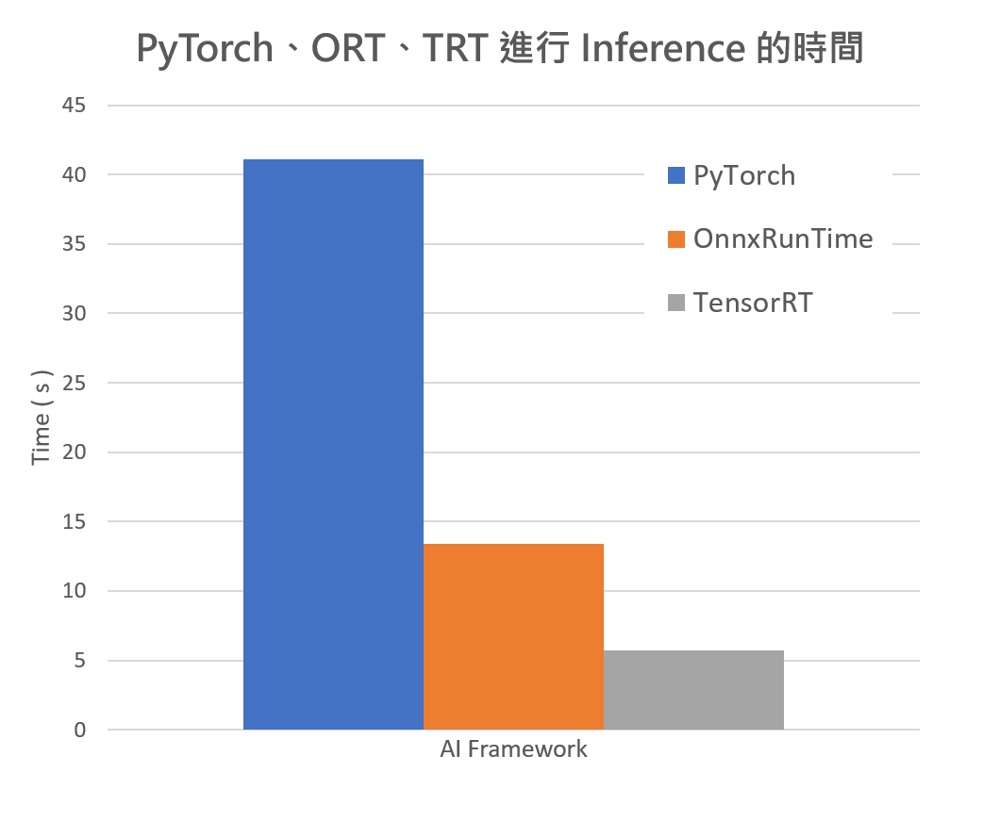
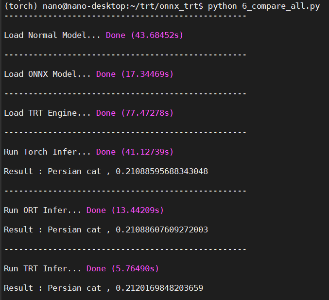

# Friendly_TensorRT_JetsonNano
Easy way to learn TensorRT on Jetson Nano

| 作者 | Chia-Chun, Chang |
| ---- | ---|
| 所屬單位  | Cavedu 教育團隊 |
| 開發日期  | 10912 |
| 文章連結  | [上篇](https://www.rs-online.com/designspark/nvidia-cudagpujetson-nano-tensorrt-cn)、[下篇](https://www.rs-online.com/designspark/nvidia-cudagpujetson-nano-tensorrt-2-cn) |
| 內容介紹  | 共分上下篇幅來介紹 TensorRT，從原理到建構方式，盡量用最簡單的方式來介紹 |

---

---

